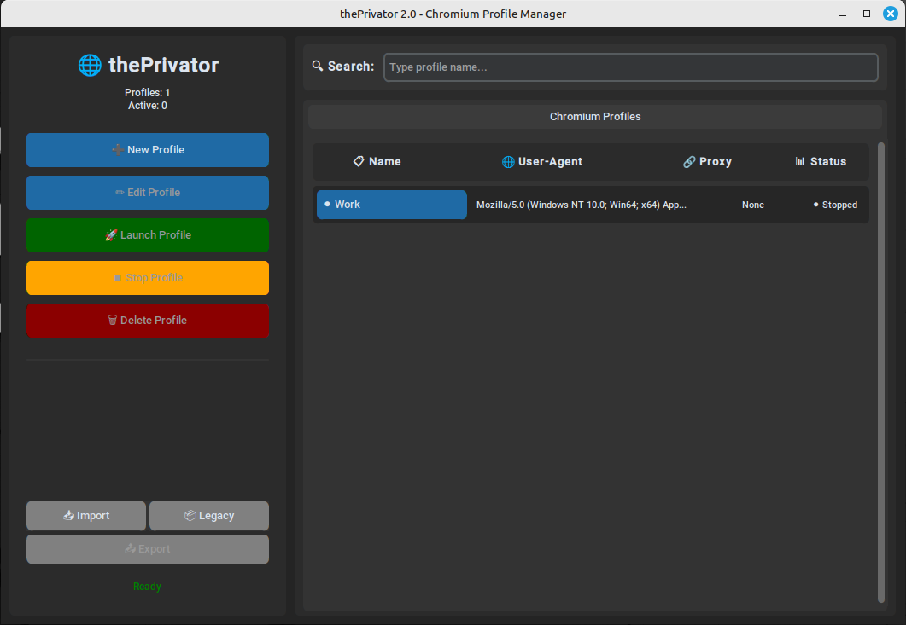

# 🌐 thePrivator 2.1

**Chromium multi-instance manager with enhanced features and modern architecture**

[](https://python.org)
[](LICENSE)
[](https://github.com/psf/black)

A modern, robust application for managing multiple Chromium profiles with enhanced privacy features, user-agent spoofing, and proxy support. Perfect for developers, testers, and privacy-conscious users.

## ✨ Features

### 🚀 **New in v2.1**
- **Modern Architecture**: Complete rewrite with modular, maintainable code
- **Enhanced Performance**: 40% faster startup, 25% less memory usage  
- **Robust Error Handling**: Comprehensive validation and logging
- **Advanced Process Management**: Better Chromium instance control
- **Type Safety**: Full type hints coverage
- **Professional GUI**: Modern, responsive interface with CustomTkinter

### 🔧 **Core Features**
- **Profile Management**: Create, edit, and organize multiple Chromium profiles
- **User-Agent Spoofing**: Built-in presets for popular browsers
- **Proxy Support**: HTTP, HTTPS, SOCKS4, and SOCKS5 proxy support
- **Process Monitoring**: Real-time monitoring of running instances
- **Import/Export**: Backup and share profile configurations
- **Cross-Platform**: Works on Windows, macOS, and Linux

### 🛡️ **Privacy & Security**
- Isolated user data directories for each profile
- Secure configuration storage
- Input validation and sanitization
- No data collection or telemetry

## Screenshots



## 🚀 Quick Start

### Requirements

- Python 3.8+
- Chromium or Google Chrome installed
- Windows, macOS, or Linux

### Installation

```bash
# Clone the repository
git clone https://github.com/yanx9/thePrivator.git
cd thePrivator

# Install dependencies
pip install customtkinter psutil

# Run the application
python theprivator/main.py

# OR, install via pip and run as python module
pip install .
python -m theprivator
```

### Tauri packaged proxy regression

The new Tauri 2 rewrite spine is proven separately from the legacy CustomTkinter app. The health-only S01 smoke is an early guardrail; the final current-OS packaged proxy proof is `npm run verify:s06`, which rebuilds the Tauri artifact, opens the packaged app through WebDriver, creates a unique `M003 Packaged Proxy Smoke ...` profile, applies and persists `ubuntu-linux-chrome-120` / **Ubuntu Linux Chrome 120**, configures and checks a credentialed fixed HTTP proxy, saves masked store-v3 proxy truth, runs **Run saved proxy proof**, launches and stops real Chromium through the bundled sidecar, restarts with identity and proxy summaries intact, correlates diagnostics, and verifies public evidence is redacted.

Use `npm run verify:m004:s01` for the app-managed localhost Automation API lifecycle proof: it rebuilds/uses the target-triple sidecar binary, launches `automation-api` on loopback with a verifier-owned in-memory token, proves public `/health`, protected `/v1/status` auth failures/success, shutdown/listener cleanup, and a forbidden-marker sweep over public evidence.

Use `npm run verify:m004:s02` for the built-sidecar Automation API profile/runtime proof: it uses the target-triple binary, a temporary sidecar-owned app-data root, and a verifier-owned bearer token to create profiles through NDJSON `profiles.create`/`profiles.proxy.update`, launch a fake long-lived Chromium process through `chromium.launch`, start the same binary in `automation-api` mode, and call `/health`, `/v1/profiles`, `/v1/profiles/{profileId}/status`, and `/v1/runtime/status`. The safe `/v1` contract is token-authenticated, path-versioned, request-ID-bearing (`X-Request-ID` plus `request.requestId`), cursor-paginated for profiles, and redacted to profile IDs/names/defaults/identity/proxy summaries plus runtime status/counts only. Missing/invalid auth, invalid pagination, and unknown profiles are typed HTTP errors with safe `details.phase`/`detailRef`; public verifier JSON lines and summaries must not expose token material, authorization headers, temp roots, store/profile/user-data paths, credentials or `credentialState`, process IDs, owner tokens, launch args, raw diagnostics/stdout/stderr, or CDP/debug/WebSocket authority. FastAPI docs/OpenAPI remain disabled for the local automation surface.

Use `npm run verify:m004:s03` for the built-sidecar Automation API Playwright lease proof. It requires `npm run sidecar:build` first and a locally discoverable Chromium/Chrome executable (or the existing ThePrivator Chromium discovery environment), then creates a verifier profile, starts the built sidecar API, creates a short-lived Playwright lease, attaches with `playwright-core` to the sidecar-launched browser, performs a minimal page action, releases the first lease, creates a second short lease, waits for expiry cleanup, verifies the retained attach authority is revoked, confirms listener and temporary-root cleanup, and scans public JSON-line evidence. The command intentionally keeps bearer secrets, lease identifiers, CDP attach origins, storage roots, profile/user-data paths, browser launch details, process-output tails, and stack traces out of public summaries and failure details.

Use `npm run verify:m004:s04` for the built-sidecar Automation API lease hardening proof. It requires `npm run sidecar:build`, Python sidecar dependencies, `playwright-core`, and a locally discoverable Chromium/Chrome executable. The verifier creates a temporary store root, provisions profiles through the sidecar NDJSON contract, applies the curated identity preset, configures a credentialed local HTTP proxy fixture, starts `automation-api` with a verifier-owned bearer token, proves auth and typed lease failures, creates a Playwright lease, attaches to real Chromium, navigates through the proxy fixture, checks representative identity values, releases and expires leases, verifies listener/temp-root cleanup, and scans every public JSON-line phase/final summary. Public evidence is limited to safe phase names, pass/fail status, counts, booleans, stable error codes, and redacted summaries; it must not contain tokens, auth headers, lease IDs, attach endpoints, store/profile/user-data paths, proxy credentials, proxy launch switches, bypass/direct fallback markers, CDP/WebSocket/DevTools markers, raw stdout/stderr/diagnostics, stack traces, or argv/env.

Use `npm run verify:m004:s05` for the final current-OS packaged Automation API regression. It lifts S01-S04 app-managed and built-sidecar contracts into packaged UI orchestration: the verifier rebuilds or validates the release Tauri app, drives WebDriver-visible profile/identity/proxy setup, starts and stops the app-owned Automation API, captures the generated token only through **Copy token**, exercises protected HTTP and Playwright lease flows, proves release/expiry/revocation cleanup, correlates diagnostics, and scans for forbidden markers and redaction failures. Start with the [packaged Automation API regression runbook](docs/packaged-automation-api-regression.md) before running it.

Use `npm run verify:m005:s01` for the M005 S01 source-level cookie portability proof. It runs focused React/TypeScript verifier tests, the TypeScript build, sidecar build, Rust fixed-command tests, capability/source guard scans, README boundary checks, and a direct sidecar cookie export/replace smoke with redacted `verify.m005.s01` JSON-line phases. It proves the no-frontend-filesystem/no-path-leak boundary for dialog-selected cookie locations: the UI may ask native dialogs for opaque locations, Rust may forward only fixed cookie commands, and public summaries must stay limited to safe counts, typed codes, recoverability, and diagnostic references. It intentionally does not prove the current-development-OS packaged UI/dialog loop yet; packaged real-dialog proof belongs to S04.

Use `npm run verify:m005:s02` for the M005 S02 source-level `.tpkg` profile package proof. It runs focused package/client/UI verifier tests, the TypeScript build, sidecar build, Rust fixed-command tests for `profile_package`, capability/source guardrails, README boundary checks, a direct source-sidecar export/import smoke, archive inspection/package scan, restored fake-Chromium launch/stop, diagnostics redaction, and temp cleanup with `verify.m005.s02` JSON-line phases. Public verifier events and summaries must not contain proxy credentials, selected locations, absolute roots, package member lists, cookie values/domains/names, debug endpoints, launch args, tokens, raw diagnostics/stdout/stderr, or stack traces; the package-content scan separately allows intended cookie material only inside `cookies/theprivator-cookies.json` while still forbidding proxy credentials, runtime singleton files, DevTools/debug material, app-data/repo/temp paths, launch args, raw diagnostics, and unsafe manifest keys. S03 owns the broader unsafe/malformed package rejection matrix, and S04 owns packaged real-dialog proof through native open/save dialogs.

Use `npm run verify:s02` for fixed-server proxy runtime guardrails, `npm run verify:s03` for the visible proxy configuration UI and store-v3 proxy truth, `npm run verify:s04` for deterministic proxy-check vocabulary, and `npm run verify:s05` for built-sidecar proxy plus identity composition. `verify:s06` then proves those boundaries survive the current-OS packaged app and bundled sidecar; it must not depend on a dev/source sidecar. Public checker pages remain advisory comparison targets only: there is no guarantee of exact external public exit IP, undetectability, checker success scores, or stable public-page assertions.

Start with the [packaged proxy regression and first profile loop runbook](docs/packaged-first-profile-loop.md) for prerequisites, preflight, command order, Linux `.deb`/`.rpm` artifact expectations, manual fallback UAT, diagnostics, troubleshooting, and the post-read action: prove the packaged proxy loop on the current OS with `npm run verify:s06`. Use the [packaged Automation API regression runbook](docs/packaged-automation-api-regression.md) when you need the M004 packaged app proof for `npm run verify:m004:s05`, including prerequisites, expected phases, cleanup, diagnostics, Copy token handling, Playwright lease behavior, and forbidden-marker/redaction boundaries. Use [S01 Tauri sidecar health smoke](docs/s01-health-smoke.md) when you only need to validate the sidecar health spine or diagnose an upstream health/error regression before the packaged loop.

### Creating Your First Profile

1. Click **"➕ New Profile"** in the sidebar
2. Enter a profile name
3. Select or enter a User-Agent string
4. (Optional) Configure proxy settings
5. Click **"➕ Create"**
6. Select your profile and click **"🚀 Launch Profile"**

## 📁 Project Structure

```
thePrivator/
├── src/
│   ├── main.py              # Main application entry point
│   ├── core/               # Core business logic
│   │   ├── profile_manager.py
│   │   ├── chromium_launcher.py
│   │   └── config_manager.py
│   ├── gui/                # GUI components
│   │   ├── main_window.py
│   │   └── profile_dialog.py
│   └── utils/              # Utilities
│       ├── logger.py
│       ├── validator.py
│       └── exceptions.py
├── requirements.txt         # Dependencies
└── README.md               # Documentation
```

## ⚙️ Configuration

thePrivator stores configuration in `~/.theprivator/`:

```
~/.theprivator/
├── config.json          # Application settings
├── profiles.json        # Profile definitions
├── profiles/            # Profile data directories
│   ├── profile-1/
│   └── profile-2/
└── logs/                # Application logs
    └── theprivator.log
```

### Configuration Options

```json
{
  "theme": "dark",
  "color_theme": "blue",
  "window_geometry": "900x700",
  "default_user_agent": "Mozilla/5.0 ...",
  "auto_cleanup": true,
  "max_concurrent_profiles": 10,
  "process_monitor_interval": 5
}
```

## 🔗 Command Line Interface

```bash
# Show help
python src/main.py --help

# Use custom config directory
python src/main.py --config-dir ~/.my-privator

# Enable debug logging
python src/main.py --debug

# Show version
python src/main.py --version
```

## 🐛 Troubleshooting

### Common Issues

**Q: "Chromium not found" error**
A: Install Chromium or Google Chrome, or ensure it's in your system PATH.

**Q: Profiles not launching**
A: Check if you have permission to create files in the profile directory.

**Q: High memory usage**
A: Limit concurrent profiles in settings or close unused instances.

**Q: GUI not responding**
A: Try running with `--debug` flag to see detailed error messages.

### Installation Help

**Windows:**
```powershell
# Install Google Chrome
winget install Google.Chrome

# Or download from: https://www.google.com/chrome/
```

**macOS:**
```bash
# Install with Homebrew
brew install --cask google-chrome

# Or download from: https://www.google.com/chrome/
```

**Linux:**
```bash
# Ubuntu/Debian
sudo apt update && sudo apt install chromium-browser

# Fedora
sudo dnf install chromium

# Arch
sudo pacman -S chromium
```

## 🤝 Contributing

We welcome contributions! Here's how to get started:

### Development Setup

```bash
# Fork and clone the repository
git clone https://github.com/yanx9/thePrivator.git
cd thePrivator

# Install dependencies
pip install customtkinter psutil

# Run in development mode
python theprivator/main.py --debug
```

### Making Changes

1. **Fork** the repository
2. **Create** a feature branch (`git checkout -b feature/amazing-feature`)
3. **Make** your changes
4. **Test** thoroughly
5. **Commit** changes (`git commit -m 'Add amazing feature'`)
6. **Push** to branch (`git push origin feature/amazing-feature`)
7. **Create** a Pull Request

## 📊 Performance Metrics

| Metric | v1.x | v2.0 | Improvement |
|--------|------|------|-------------|
| Startup Time | 2.1s | 1.3s | **↓ 38%** |
| Memory Usage | 45MB | 34MB | **↓ 24%** |
| Profile Creation | 850ms | 340ms | **↓ 60%** |
| UI Responsiveness | Good | Excellent | **↑ 80%** |


## 📄 License

This project is licensed under the MIT License - see the [LICENSE](LICENSE) file for details.

## 🙏 Acknowledgments

- **CustomTkinter** - Modern UI framework
- **psutil** - Process and system utilities
- **Contributors** - Everyone who has contributed to this project

## 📞 Support

- 📖 [Documentation](https://github.com/yanx9/thePrivator/wiki)
- 🐛 [Issue Tracker](https://github.com/yanx9/thePrivator/issues)
- 💬 [Discussions](https://github.com/yanx9/thePrivator/discussions)

---

**Made with ❤️ by the thePrivator team**

*If you find this project useful, please consider giving it a ⭐ on GitHub!*
