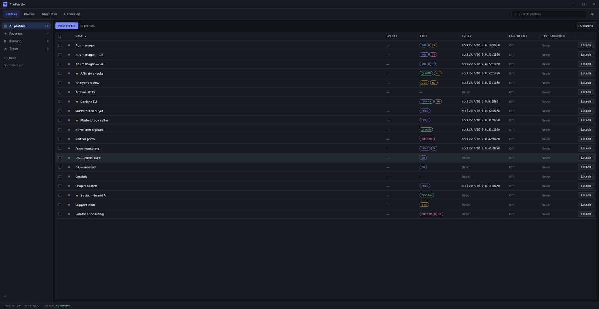

# ThePrivator

A desktop manager for isolated browser profiles. Each profile is its own browser
identity — separate cookies and storage, its own proxy, and a fingerprint you
control surface by surface — so accounts that must not be linked stay unlinked.



Everything stays on your machine. There is no account, no server of ours, and no
telemetry. Profiles travel between your own devices only if you point the app at
a folder your own sync client already keeps up to date.

## What it does

- **Profiles as a table.** Folders, tags, notes, favourites, start URLs, bulk
  launch and stop, and a trash you can restore from.
- **Fingerprint control across 11 surfaces** — browser, navigator, screen,
  locale, canvas, audio, WebGL, WebRTC, geolocation, media devices and local
  port access. Each is `real`, `masked`, `custom` or noise-seeded, with curated
  API-generated presets as a starting point, plus **Real** to disable all masking.
- **A consistency check, not just a mask.** Masking is not monotonic: a
  geolocation that contradicts your proxy's exit country makes a profile *more*
  identifiable, not less. The app warns when surfaces disagree.
- **Proxies per profile**, including authenticated SOCKS5 — Chromium cannot do
  SOCKS authentication itself, so the sidecar runs a local relay for it. A proxy
  check reports what it actually proved, and says "not established" when it
  proved nothing. Use **Check proxy** in a profile's context menu to refresh
  its observed public exit IP and country flag in the proxy column. The country
  is an IP-geolocation estimate, not a guarantee of the server's physical location.
- **Cookie import and export** directly from a profile's **Cookies** context
  submenu. Import accepts browser-export JSON arrays as well as ThePrivator
  JSON and Netscape `cookies.txt`. JSON export uses the same browser-array format
  as import; export is JSON-only (legacy TXT import remains available),
  and whole-profile `.tpkg` packages that carry the fingerprint, the proxy and
  the browsing data — but never the proxy password.
- **Cookie bot** visits your URLs in the selected profile with its proxy and
  fingerprint, with bounded same-origin link crawling. Cookies come from the
  websites themselves; the bot does not fabricate sessions or guarantee that
  a site will set cookies. You can cancel a run or close the profile when it ends.
- **Profile synchronisation through a folder** you already sync with Google
  Drive, Syncthing or rclone. No OAuth, no token, nothing sent to us.
- **A local automation endpoint** for Selenium, Playwright or Puppeteer. It
  listens on loopback and needs an access token, which is never displayed —
  copying puts it on the clipboard and nowhere else.

## Cookies from the profile menu

Right-click a profile and open **Cookies** to import or export without leaving
the profile list. Stop the profile before importing or exporting. Import
replaces its existing cookie set, so export a backup first if you need one.
Cookie exports can contain active login sessions: keep them private and only
import sessions you are authorized to use.

JSON cookie files are a top-level array (no wrapper), with `name`, `path`,
`value`, `domain`, `secure`, `session`, `storeId`, `hostOnly`, `httpOnly`,
`sameSite`, and `expirationDate`. Exports use `storeId: "Default"` and SameSite
values `Lax`, `Strict`, `None`, or `Unspecified`. Session cookies have
`expirationDate: 0`; persistent expiry is Unix seconds, preserving fractions
up to Chromium's microsecond precision. No epoch is guessed from a number's size.
Import honors `hostOnly` over a conflicting leading dot in `domain`, normalizing
the domain to the scope Chromium stores. Source `storeId` does not select the
destination profile. Internal `.tpkg` cookie payloads retain their versioned
format and whole-second expiry for compatibility with older package readers.

**Run Cookie Bot** accepts URLs separated by spaces, commas or newlines. Bare
hostnames use HTTPS. Leaving the list empty uses the default websites shown in
the dialog. The bot follows a limited set of same-origin links; it does not
submit forms, log in, accept consent banners, or click purchase buttons. Sites
may therefore set few or no cookies. Page, depth and time limits keep each run
bounded, and cancellation stops the run without deleting existing cookies.

## Install

Download a build from the [releases](../../releases) page:

| Platform | Files |
| --- | --- |
| Linux | `.deb`, `.rpm`, `.AppImage` |
| macOS | `.dmg` (Apple silicon and Intel) |
| Windows | `.msi`, `.exe` |

You also need Chromium or Google Chrome installed; the app launches the browser
you already have rather than shipping one. Point it somewhere specific with
`THEPRIVATOR_CHROMIUM_PATH` if it is not on the usual path.

## Build from source

Requires **Node 20.19+**, **Python 3.11+**, **Rust 1.77+**, and on Linux the
WebKitGTK development packages:

```bash
sudo apt install libwebkit2gtk-4.1-dev libappindicator3-dev librsvg2-dev patchelf
```

Then:

```bash
npm ci
python -m venv .venv && .venv/bin/pip install -r requirements.txt -r requirements-dev.txt
npm run tauri build
```

Installers land in `src-tauri/target/release/bundle/`.

On macOS, build with `npm run tauri build -- --bundles app,dmg`. The sidecar
uses a directory-based Python runtime in `Contents/Frameworks`, avoiding
temporary library extraction on every launch. To verify the shipped runtime:

```bash
THEPRIVATOR_VERIFY_SIDECAR_BINARY="src-tauri/target/release/bundle/macos/ThePrivator.app/Contents/MacOS/theprivator-sidecar" npm run verify:sidecar
```

For development, `npm run tauri dev` rebuilds the frontend on save.

**One build produces one platform.** The Python sidecar is packed with
PyInstaller, which bundles the host's interpreter and native libraries and has
no cross-compilation mode — so a macOS build needs a Mac and a Windows build
needs Windows, whatever the Rust side could otherwise manage. The
[release workflow](.github/workflows/release.yml) runs one runner per platform
for exactly that reason.

## How it fits together

```
React frontend  ──invoke──▶  Rust bridge  ──NDJSON over stdio──▶  Python sidecar  ──▶  Chromium
   src/                       src-tauri/                           theprivator_sidecar/
```

The Rust bridge owns nothing but transport, timeouts and diagnostics. The
sidecar owns the profile store, the proxy runtime, the fingerprint engine and
the browser lifecycle. The frontend never talks to the filesystem or spawns a
process.

Two rules run through the whole codebase and are worth knowing before changing
anything:

- **The redaction perimeter.** Absolute paths, proxy credentials, browser
  command lines and automation tokens must not reach the UI. The sidecar redacts
  and the TypeScript client independently rejects — a response carrying one is
  refused, not rendered. Errors carry an opaque reference instead, which
  Settings → Diagnostics exchanges for the detail behind it.
- **Strict-key parsing.** Every sidecar response is validated field by field on
  both sides. An unexpected key is an error, not something to ignore, so a
  protocol drift surfaces at the boundary rather than three screens later.

## Tests

```bash
npx tsc --noEmit        # types
npx vitest run          # frontend and component tests
python -m pytest tests/ # sidecar
cd src-tauri && cargo test
npm run verify:sidecar  # the packed binary, not the source
```

That last one matters more than it looks: the sidecar imports some modules
lazily, so a missing `--hidden-import` can leave a feature broken only in the
packaged build while every from-source test passes.

## Licence

MIT — see [LICENSE](LICENSE).
